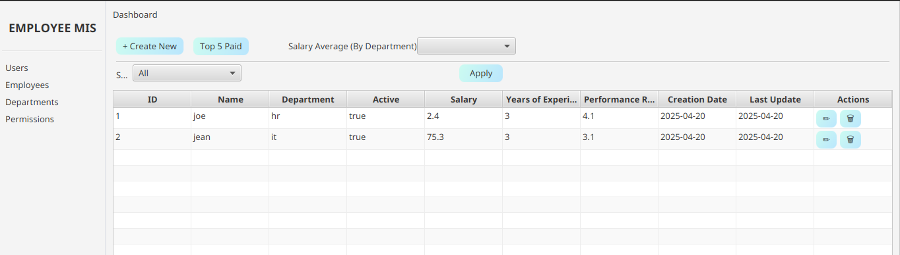
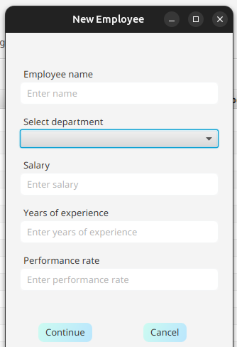
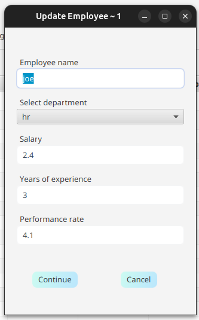

<p align="center">
  
</p>
<h3 align="center">EMPLOYEE MANAGEMENT SYSTEM</h3>
<hr>

*Employee management system* offers simple operations to manage records, like, creating, updating, and deleting.
It also offers a wide range of advanced functionalities, like sorting & filtering.
The system has both `cli` and `GUI` version.

---

## Live version
- [Project Instructions](https://amalitech-training.notion.site/Employee-Management-System-1ca6c750c0d5818a9e05f5baa28a9e0b)
- [Video](https://docs.google.com/document/d/1WKfelpY1eYdCyLg3MtnKBWgefOgZPXA1UVdIKDvZNhI/edit?usp=sharing)

## Built with


---

## Getting Started
To ge this program running on your local environment, 
1. First, install `Java 17.+`
2. Install `Java FX` - `@latest`
3. Clone the repository ([link](https://github.com/sntakirutimana72/EmployeeMIS))

## How does it work?
Each application version `cli`/`GUI` has its own `entry point`.

- `cli` entry point is in the `cli` package
  ```Java
    package com.employeemis.cli;
    
    public class Main {}
  ```
- Whereas `GUI`'s is directly in main package
  ```Java
  package com.employeemis;
  
  public class Main extends javafx.application.Application {}
  ```
  
### How To Operate `CLI` app version?
`cli` version offers command line interface functionalities where user is prompted to select an action to be performed.
Given the selection, user may be required to going down the further, while selecting an action after another.

For example:
- `Main Menu` ~ Here user can then start interacting with records.
  ```shell
  +--------------------------------------------------+
  |      Welcome To Employee Management System       |
  +--------------------------------------------------+
  *** Select option ***
  1. Employees
  2. Departments
  3. Exit
  >
  ```
- `1. Employees` **Menu** ~ User can browse through various options like `Listing`, `CRUD operations`, ...
    ```shell
    +--------------------------------------------------+
    |                  Employee Menu                   |
    +--------------------------------------------------+
    *** Select option ***
    1. List Employees
    2. Show Employee Salary Average (By Department)
    3. Create Employee
    4. Update Employee
    5. Delete Employee
    >
    ```
  - `1. List Employees` **Menu**
    ```shell
    +-------------------------------------------------------+
    |                  Employee List Menu                   |
    +-------------------------------------------------------+
    *** Select option ***
    1. List All
    2. List Top 5 Paid
    3. Filter By
    4. Sort By (DESC)
    >
    ```
    - `3. Filter By` **Menu**
      ```shell
      *** Select filter ***
      1. Filter by department
      2. Filter by name
      3. Filter by salary range (eg: 75-500)
      4. Filter by performance rate (>= X)
      >
      ```
    - `4. Sort By (DESC)` **Menu**
      ```shell
      *** Select option ***
      1. Sort by years of experience (DESC)
      2. Sort by performance rate (DESC)
      3. Sort by salary (DESC)
      >
      ```
- `2. Departments` **Menu**
  ```shell
  +--------------------------------------------------+
  |                 Department Menu                  |
  +--------------------------------------------------+
  *** Select option ***
  1. List Departments
  2. Create Department
  3. Update Department
  4. Delete Department
  >
  ```

**NOTE**:
  - `...` ~ allows user to go back one level from anywhere in the application.
  - `exit` ~ allows user to terminate the application from anywhere.

### How To Operate `GUI` app version?
This version doesn't require `authentication` to operate it. So, once fired up, you get straight to business.
<table>
  <tr>
    <th>Employee View</th>
    <td>
      
    </td>
  </tr>
</table>
<table>
  <thead>
    <tr>
      <th>Employee Create Form</th>
      <th>Employee Update Form</th>
    </tr>
  </thead>
  <tbody>
    <td>
      
    </td>
    <td>
      
    </td>
  </tbody>
</table>

---
## Authors

👤 **Steve**
- GitHub: [@sntakirutimana72](https://github.com/sntakirutimana72/)

---

## 🤝 Contributing

Contributions, issues, and feature requests are welcome!

Feel free to check the [issues page](https://github.com/sntakirutimana72/EmployeeMIS/issues/)

---

## Show your support

Give a ⭐️ if you like this project!

---

## Acknowledgments

- Devs Communities for great free and resourceful articles.

---

## 📝 License

This project is [MIT](./LICENSE) licensed.
